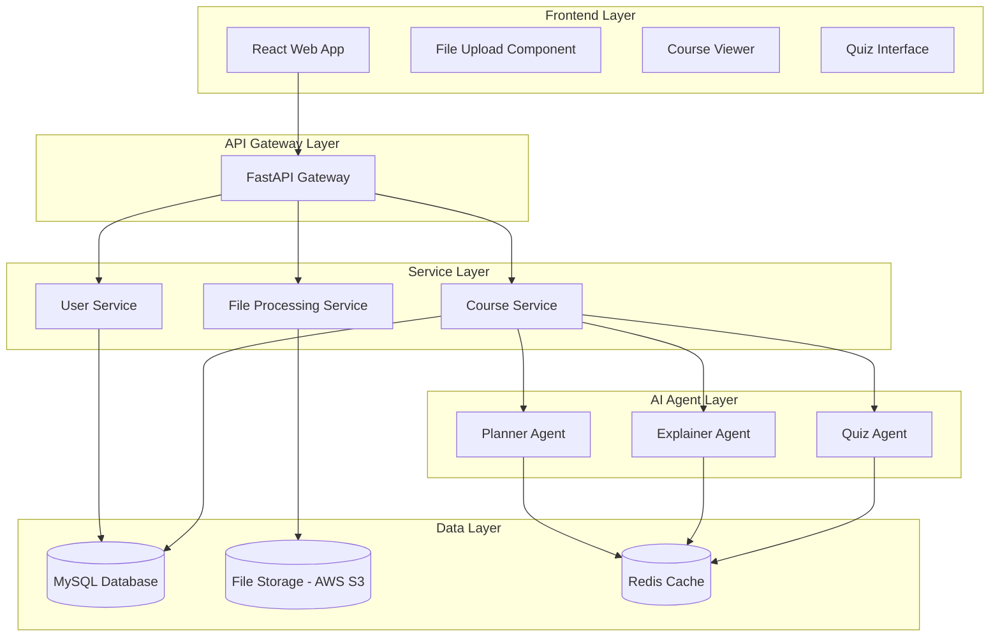

# Design Document

## Overview

Mentora is a web-based AI educational platform built with a microservices architecture to handle the complex workflow of personalized course generation. The system consists of a React frontend, Python backend API, and three specialized AI agents (Planner, Explainer, Quiz) that work together to transform user input and uploaded materials into structured, interactive learning experiences.

## Architecture

### High-Level Architecture



### Technology Stack

**Frontend:**
- React 18 with JavaScript
- Mantine UI component library
- React Query for state management and caching
- React Router for navigation
- Axios for API communication

**Backend:**
- Python with FastAPI
- Google Agent Development Kit for AI agent orchestration
- JWT for authentication
- Python-multipart for file upload handling
- Celery with Redis for background job processing

**AI Integration:**
- Google Gemini for content generation
- Google Agent Development Kit for agent orchestration
- Custom prompt engineering for each agent type

**Database & Storage:**
- MySQL for structured data with SQLAlchemy ORM
- AWS S3 for file storage
- Redis for caching and session management

## Components and Interfaces

### Frontend Components

#### 1. Learning Query Interface
```javascript
// LearningQueryProps
const LearningQuery = ({ onQuerySubmit, isLoading }) => {
  // Component implementation
};

// LearningPreferences object structure
const learningPreferences = {
  timeAvailable: 10, // hours per week
  difficulty: 'beginner', // 'beginner' | 'intermediate' | 'advanced'
  learningStyle: 'visual' // 'visual' | 'auditory' | 'kinesthetic' | 'mixed'
};
```

#### 2. Course Outline Component
```javascript
// CourseOutline object structure
const courseOutline = {
  id: 'course-123',
  title: 'Introduction to Machine Learning',
  chapters: [], // Array of Chapter objects
  estimatedDuration: 40, // hours
  difficulty: 'intermediate'
};

// Chapter object structure
const chapter = {
  id: 'chapter-1',
  title: 'Linear Regression Basics',
  objectives: ['Understand linear relationships', 'Implement basic regression'],
  estimatedTime: 4, // hours
  status: 'ready' // 'pending' | 'generating' | 'ready' | 'completed'
};
```

#### 3. Interactive Content Viewer
```javascript
// InteractiveContent object structure
const interactiveContent = {
  type: 'diagram', // 'text' | 'diagram' | 'chart' | 'interactive'
  content: {}, // Content data based on type
  interactions: [] // Array of Interaction objects
};

// Interaction object structure
const interaction = {
  type: 'click', // 'click' | 'hover' | 'drag'
  element: 'diagram-node-1',
  action: () => { /* callback function */ }
};
```

### Backend API Endpoints

#### Course Management API
```python
# FastAPI endpoint definitions
from fastapi import FastAPI, UploadFile
from pydantic import BaseModel

class LearningPreferences(BaseModel):
    time_available: int
    difficulty: str
    learning_style: str

class CourseCreateRequest(BaseModel):
    query: str
    preferences: LearningPreferences

@app.post("/api/courses/create")
async def create_course(request: CourseCreateRequest, files: List[UploadFile]):
    # Implementation

@app.get("/api/courses/{course_id}/outline")
async def get_course_outline(course_id: str):
    # Returns CourseOutline

@app.get("/api/courses/{course_id}/chapters/{chapter_id}/content")
async def get_chapter_content(course_id: str, chapter_id: str):
    # Returns InteractiveContent

@app.post("/api/courses/{course_id}/chapters/{chapter_id}/quiz/submit")
async def submit_quiz(course_id: str, chapter_id: str, answers: List[dict]):
    # Process quiz submission
```

#### File Processing API
```python
@app.post("/api/files/upload")
async def upload_files(files: List[UploadFile]):
    # Handle file upload

@app.get("/api/files/{file_id}/process-status")
async def get_file_status(file_id: str):
    # Returns processing status
```

### AI Agent Interfaces

#### 1. Planner Agent
```python
# Using Google Agent Development Kit
from google.cloud import aiplatform
from pydantic import BaseModel

class PlannerInput(BaseModel):
    learning_query: str
    extracted_content: List[str]
    preferences: dict

class PlannerOutput(BaseModel):
    course_title: str
    chapters: List[dict]
    total_duration: int

class PlannerAgent:
    def __init__(self):
        # Initialize Google Agent Development Kit
        pass
    
    async def plan_course(self, input_data: PlannerInput) -> PlannerOutput:
        # Use Google Gemini to generate course plan
        pass
```

#### 2. Explainer Agent
```python
class ExplainerInput(BaseModel):
    chapter_title: str
    objectives: List[str]
    key_topics: List[str]
    source_content: str
    difficulty: str

class ExplainerOutput(BaseModel):
    content: dict  # Contains sections, visualizations, interactive elements

class ExplainerAgent:
    def __init__(self):
        # Initialize Google Agent Development Kit
        pass
    
    async def create_content(self, input_data: ExplainerInput) -> ExplainerOutput:
        # Generate interactive content using Google Gemini
        pass
```

#### 3. Quiz Agent
```python
class QuizInput(BaseModel):
    chapter_content: str
    learning_objectives: List[str]
    difficulty: str

class QuizOutput(BaseModel):
    questions: List[dict]

class QuizAgent:
    def __init__(self):
        # Initialize Google Agent Development Kit
        pass
    
    async def generate_quiz(self, input_data: QuizInput) -> QuizOutput:
        # Generate quiz questions using Google Gemini
        pass
```

## Data Models

### User Model
```python
from pydantic import BaseModel
from datetime import datetime
from typing import List, Optional

class User(BaseModel):
    id: str
    email: str
    name: str
    preferences: dict  # LearningPreferences
    courses: List[str]  # course IDs
    created_at: datetime
    updated_at: datetime
```

### Course Model
```python
class Course(BaseModel):
    id: str
    user_id: str
    title: str
    query: str
    preferences: dict  # LearningPreferences
    outline: dict  # CourseOutline
    chapters: List[dict]  # ChapterContent
    progress: dict  # Progress tracking
    status: str  # 'planning' | 'generating' | 'ready' | 'completed'
    created_at: datetime
    updated_at: datetime
```

### File Model
```python
class UploadedFile(BaseModel):
    id: str
    user_id: str
    course_id: str
    original_name: str
    mime_type: str
    size: int
    s3_key: str
    extracted_text: Optional[str]
    processing_status: str  # 'pending' | 'processing' | 'completed' | 'failed'
    created_at: datetime
```

## Error Handling

### Frontend Error Handling
- Global error boundary for React components
- Toast notifications for user-facing errors
- Retry mechanisms for failed API calls
- Offline detection and graceful degradation

### Backend Error Handling
- Centralized error middleware
- Structured error responses with error codes
- Logging with Winston for debugging
- Circuit breaker pattern for AI agent calls

### AI Agent Error Handling
- Retry logic with exponential backoff
- Fallback content generation for agent failures
- Rate limiting and quota management
- Content validation and sanitization

## Testing Strategy

### Unit Testing
- Jest for JavaScript testing
- React Testing Library for component testing
- Pytest for Python backend testing
- Mock AI agent responses for consistent testing

### Integration Testing
- End-to-end course creation workflow
- File upload and processing pipeline
- AI agent integration testing
- Database transaction testing

### Performance Testing
- Load testing for concurrent course generation
- File upload performance testing
- AI agent response time monitoring
- Database query optimization testing

### User Acceptance Testing
- Course quality evaluation
- User experience testing
- Accessibility compliance testing
- Cross-browser compatibility testing

## Security Considerations

### Authentication & Authorization
- JWT-based authentication
- Role-based access control
- API rate limiting
- CORS configuration

### Data Protection
- File upload validation and sanitization
- SQL injection prevention
- XSS protection
- Encrypted data storage for sensitive information

### AI Safety
- Content filtering for generated material
- Prompt injection prevention
- Output validation and sanitization
- Usage monitoring and anomaly detection