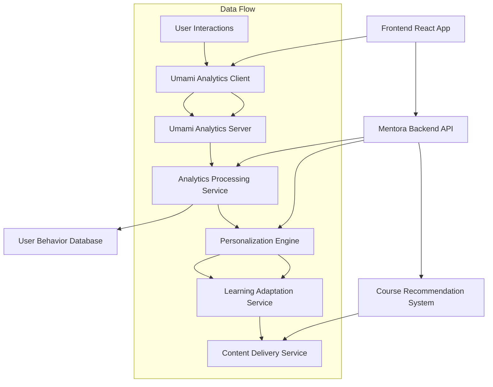

# Design Document

## Overview

This design integrates Umami analytics into Mentora to create a privacy-compliant user behavior tracking system that enables personalized learning experiences. The system will collect interaction data, analyze learning patterns, and automatically adapt content delivery to individual user preferences and capabilities.

## Architecture

### High-Level Architecture



### Integration Points

1. **Frontend Integration**: Umami tracking script embedded in React components
2. **Backend Analytics API**: Service layer for processing Umami data
3. **Personalization Engine**: ML-based system for learning pattern analysis
4. **Content Adaptation**: Dynamic content delivery based on user profiles

## Components and Interfaces

### Frontend Components

#### UmamiTracker Component
```typescript
interface UmamiTrackerProps {
  websiteId: string;
  src: string;
  domains?: string[];
}

interface TrackingEvent {
  name: string;
  data?: Record<string, any>;
}
```

#### LearningAnalytics Component
```typescript
interface LearningAnalyticsProps {
  userId: string;
  courseId: string;
  chapterId?: string;
}

interface UserLearningMetrics {
  timeSpent: number;
  completionRate: number;
  engagementScore: number;
  difficultyPreference: 'beginner' | 'intermediate' | 'advanced';
}
```

### Backend Services

#### Analytics Processing Service
```python
class AnalyticsProcessingService:
    async def process_umami_data(self, website_id: str) -> List[UserBehaviorData]
    async def calculate_engagement_metrics(self, user_id: str) -> EngagementMetrics
    async def identify_learning_patterns(self, user_id: str) -> LearningPatterns
```

#### Personalization Engine
```python
class PersonalizationEngine:
    async def generate_user_profile(self, user_id: str) -> UserLearningProfile
    async def adapt_content_difficulty(self, content_id: str, user_profile: UserLearningProfile) -> AdaptedContent
    async def recommend_learning_path(self, user_id: str, topic: str) -> List[CourseRecommendation]
```

#### Learning Adaptation Service
```python
class LearningAdaptationService:
    async def adjust_pacing(self, user_id: str, course_id: str) -> PacingAdjustment
    async def provide_supplementary_content(self, user_id: str, topic: str) -> List[SupplementaryMaterial]
    async def modify_assessment_difficulty(self, user_id: str, assessment_id: str) -> AssessmentModification
```

## Data Models

### User Behavior Data
```python
class UserBehaviorData(BaseModel):
    id: str
    user_id: str
    session_id: str
    event_type: str  # page_view, click, scroll, time_spent
    page_url: str
    timestamp: datetime
    metadata: Dict[str, Any]
    engagement_score: float
```

### Learning Pattern
```python
class LearningPattern(BaseModel):
    id: str
    user_id: str
    pattern_type: str  # visual, auditory, kinesthetic, reading
    confidence_score: float
    preferred_content_types: List[str]
    optimal_session_duration: int
    difficulty_progression_rate: float
    created_at: datetime
    updated_at: datetime
```

### User Learning Profile
```python
class UserLearningProfile(BaseModel):
    id: str
    user_id: str
    learning_style: str
    attention_span: int  # minutes
    preferred_difficulty: str
    completion_rate: float
    average_session_duration: int
    strong_topics: List[str]
    challenging_topics: List[str]
    last_updated: datetime
```

### Course Recommendation
```python
class CourseRecommendation(BaseModel):
    id: str
    user_id: str
    course_id: str
    recommendation_score: float
    reason: str
    recommended_difficulty: str
    estimated_completion_time: int
    created_at: datetime
```

## Error Handling

### Analytics Data Collection
- **Network Failures**: Implement retry logic with exponential backoff
- **Invalid Data**: Validate and sanitize all incoming analytics data
- **Privacy Violations**: Ensure no PII is collected or stored
- **Rate Limiting**: Implement throttling for analytics API calls

### Personalization Engine
- **Insufficient Data**: Provide default recommendations for new users
- **Model Failures**: Fallback to rule-based recommendations
- **Performance Issues**: Cache frequently accessed user profiles
- **Data Inconsistency**: Implement data validation and cleanup routines

## Testing Strategy

### Unit Testing
- Test individual analytics processing functions
- Mock Umami API responses for consistent testing
- Validate personalization algorithm outputs
- Test privacy compliance measures

### Integration Testing
- Test end-to-end analytics data flow
- Verify Umami integration with React components
- Test personalization engine with real user data
- Validate recommendation system accuracy

### Performance Testing
- Load test analytics processing with high user volumes
- Benchmark personalization engine response times
- Test real-time adaptation system performance
- Monitor memory usage during analytics processing

### Privacy Testing
- Verify no cookies are set by Umami integration
- Test data anonymization processes
- Validate GDPR compliance measures
- Test user data deletion functionality

## Implementation Phases

### Phase 1: Basic Analytics Integration
- Integrate Umami tracking in React frontend
- Set up Umami server and configuration
- Create basic analytics data collection endpoints
- Implement privacy-compliant data storage

### Phase 2: Learning Pattern Analysis
- Develop user behavior analysis algorithms
- Create learning pattern identification system
- Build user learning profile generation
- Implement basic content adaptation

### Phase 3: Personalization Engine
- Build ML-based recommendation system
- Implement dynamic difficulty adjustment
- Create personalized learning path generation
- Add real-time content adaptation

### Phase 4: Advanced Features
- Implement predictive learning analytics
- Add collaborative filtering for recommendations
- Create advanced visualization dashboards
- Build A/B testing framework for personalization

## Security Considerations

### Data Privacy
- All analytics data is anonymized and aggregated
- No personal identifiers stored in analytics database
- GDPR-compliant data retention policies
- User consent management for analytics collection

### API Security
- Rate limiting on analytics endpoints
- Authentication required for sensitive analytics data
- Input validation and sanitization
- Secure communication with Umami server

### Data Protection
- Encryption at rest for user behavior data
- Secure data transmission protocols
- Regular security audits of analytics pipeline
- Access controls for analytics data